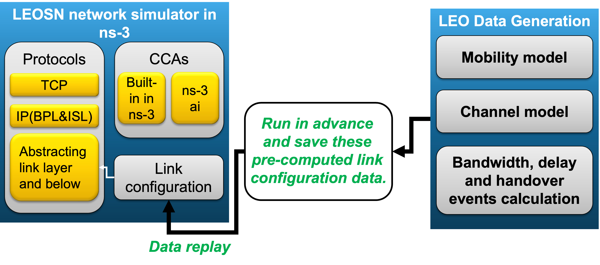

# CREO+

This repository contains the CREO+ LEOSN data generator, trace-driven ns-3.41
implementation, Linux TCP implementation.

CREO+ separates route/link generation from transport experiments. Capacity,
propagation delay, and handover events are generated once and replayed by ns-3
or Linux.

## Core implementation

- `LEOSN Data Generation/` computes BPL/ISL routes and exports capacity and
  propagation-delay traces.
- `LEOSN Network Simulation/ns3-creo/` is an overlay for ns-3.41. Its connected
  phase implements RTT-adaptive statistical periods, burst-pacing capacity
  sampling, Daubechies DWT denoising, PDPA action construction, three temporal
  LSTMs, a metric CNN, and discrete SAC control of TCP `cwnd` and pacing rate.
- `LEOSN Network Simulation/ns3-creo/ns3-overlay/scratch/creo-handover-notification/`
  implements sequenced UDP handover notification, ACK, retry, and scheduled
  callback handling.
- `linux-creo/` provides the loadable `creo` Linux CCA, its binary per-flow
  state/action ABI, shared PyTorch model service, and trace-replay evaluators.
- `LEOSN Network Simulation/leocc-ns3/` contains the trace-driven LeoCC
  reproduction and connected/handover experiment drivers.

## Quick start

1. Generate or inspect traces in `LEOSN Data Generation/`.
2. Follow `LEOSN Network Simulation/ns3-creo/README.md` to install the overlay,
   build ns-3, train for 10000 updates.
3. Follow `linux-creo/README.md` to build the kernel module, start the shared
   model service, and select `creo` for a TCP socket.
